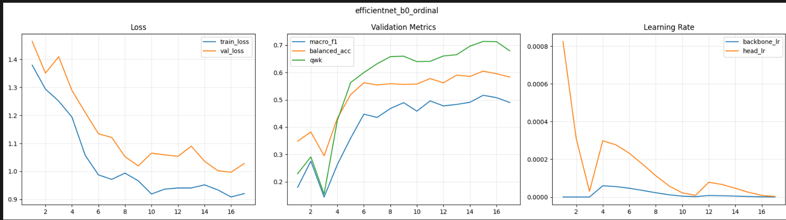

🩺 Deep Learning-Based Classification of Diabetic Kidney Disease Severity from Histopathology Images
::: {align="center"}


🔬 AI-Powered Histopathology Image Analysis using Vision Transformers & Ensemble Learning
> **An end-to-end deep learning framework for automated diabetic kidney
> disease severity classification from histopathology images.**
:::
---
📖 Overview
Diabetic Kidney Disease (DKD) is one of the leading causes of chronic
kidney failure worldwide. Manual assessment of kidney biopsy slides is
time-consuming and requires expert pathologists.
This project introduces an AI-driven diagnostic framework that combines
Vision Transformers (ViT-B/16), EfficientNet-B0, CNN feature
extraction, and Soft Ensemble Learning to classify DKD severity
from histopathology images.
✨ Key Features
🧠 Vision Transformer (ViT-B/16)
⚡ EfficientNet-B0
🔬 Histopathology Image Classification
📈 Soft Ensemble Learning
🏥 Healthcare AI
📊 Robust Evaluation Metrics
📷 Medical Image Processing
🚀 TensorFlow/Keras Implementation
---
🛠️ Tech Stack
Languages: Python
Frameworks: TensorFlow, Keras
Libraries: NumPy, Pandas, OpenCV, Matplotlib, Scikit-Learn
Environment: Jupyter Notebook
---
📂 Dataset
Attribute   Details
---
Dataset     KidneyAI Dataset
Source      Zenodo
Images      3,928 PAS-Stained Glomerulus Images
Classes     Normal, Mild, Moderate, Severe, Excluded
Format      PNG + JSON
🔗 https://zenodo.org/records/17456927
---
🏗️ AI Pipeline
``` text
📂 KidneyAI Dataset
        │
        ▼
🖼️ Image Preprocessing
        │
        ▼
🧠 CNN Feature Extraction
        │
        ▼
🤖 Vision Transformer (ViT-B/16)
        │
        ▼
⚡ EfficientNet-B0
        │
        ▼
🤝 Soft Ensemble Fusion
        │
        ▼
🎯 Disease Severity Prediction
```
---
🖼️ Model Architecture
> Replace with your architecture image.
``` markdown
<p align="center">
  
</p>
```
---
📊 Results
Model Comparison
Model                 Validation Accuracy   Test Accuracy
---
ConvNeXt-Small                      84.3%           83.1%
ViT-B/16                            86.7%           85.3%
🥇 Ensemble Model               88.1%       87.2%
Final Metrics
Metric              Score
---
Accuracy           0.7169
Macro AUC          0.9192
Top-2 Accuracy     0.9779
MCC                0.6196
QWK                0.8747
---
🖼️ Results Gallery
``` markdown
<p align="center">


</p>

<p align="center">


</p>
```
---
📂 Project Structure
``` text
📦 DKD-Classification
┣ 📜 kidney_clean.ipynb
┣ 📜 analyze.py
┣ 📜 requirements.txt
┣ 📜 model architecture.png
┣ 📜 vit_tranning_results.png
┣ 📜 efficientnet_bo_ordinal.png
┣ 📜 model.comprasion,png.png
┣ 📜 soft_essemble_png.png
┗ 📜 README.md
```
---
🌍 Applications
Medical Image Analysis
AI-assisted Diagnosis
Clinical Decision Support
Biomedical Research
Healthcare AI
---
🚀 Roadmap
✅ DKD Severity Classification
✅ Vision Transformer Integration
✅ Ensemble Learning
🔄 Explainable AI (Grad-CAM)
🔄 Web Deployment
🔄 Cloud Inference
🔄 Clinical Dashboard
---
👩‍💻 Author
Krishnam Namithaa
AI Engineer | Full Stack Developer | Machine Learning Enthusiast
---
📜 License
This repository is intended for academic and research purposes.
---
::: {align="center"}
⭐ If you found this project useful, consider giving it a Star!
Made with ❤️ by Krishnam Namithaa
:::
