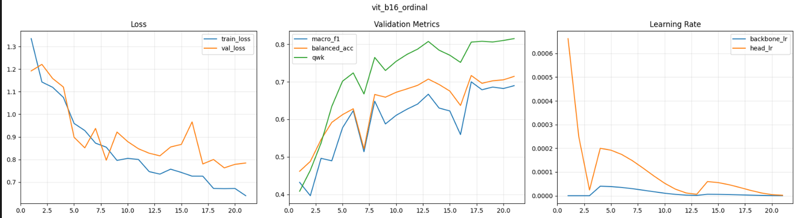
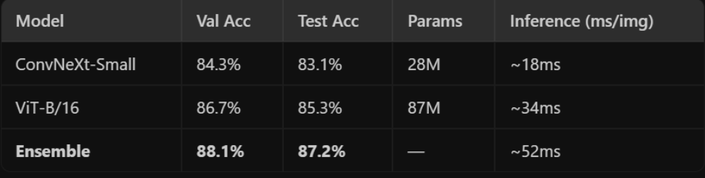
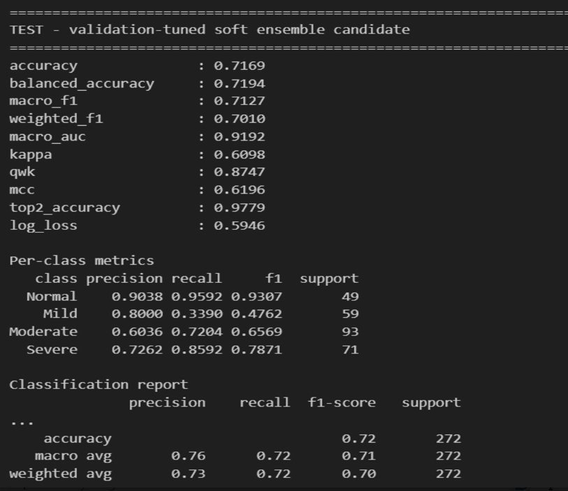

# Deep Learning-Based Classification of Diabetic Kidney Disease Severity from Histopathology Images

## Overview

Diabetic Kidney Disease (DKD) is one of the leading causes of chronic kidney failure worldwide. Early diagnosis and accurate severity classification are essential for improving patient outcomes and treatment planning.

This project presents a Deep Learning-based framework for automated classification of diabetic kidney disease severity from histopathology images. The framework leverages Convolutional Neural Networks (CNNs), Vision Transformers (ViT), Ensemble Learning, and Data Augmentation techniques to improve prediction accuracy and robustness.

---

## Problem Statement

Manual analysis of kidney histopathology images is time-consuming and requires expert pathologists. This project aims to automate the classification process using Artificial Intelligence and Deep Learning to support healthcare professionals and improve diagnostic efficiency.

---

## Objectives

- Automate diabetic kidney disease severity classification.
- Apply deep learning techniques to medical image analysis.
- Improve classification accuracy using ensemble learning.
- Reduce overfitting through data augmentation.
- Support AI-assisted medical diagnosis.

---

## Technologies Used

- Python
- TensorFlow
- Keras
- NumPy
- Pandas
- OpenCV
- Matplotlib
- Scikit-Learn
- Jupyter Notebook

---

## Dataset

This project utilizes the **KidneyAI Dataset**, a publicly available histopathology image dataset developed for diabetic kidney disease severity classification and research.

### Dataset Information

| Attribute | Details |
|------------|------------|
| Dataset Name | KidneyAI Dataset |
| Source | Zenodo |
| DOI | 10.5281/zenodo.17456927 |
| Total Images | 3,928 PAS-stained glomerulus images |
| Image Type | Histopathology Images |
| Image Format | PNG |
| Annotation Format | JSON |
| Classes | Normal, Mild, Moderate, Severe, Excluded |

### Dataset Link

🔗 https://zenodo.org/records/17456927

### Deep Learning Concepts Used

#### Convolutional Neural Networks (CNNs)

CNNs are widely used for extracting local texture and tissue features from medical images.

#### Transformer-Based Models

Transformer-based models capture long-range dependencies and global contextual information from image data.

#### Ensemble Learning

Ensemble learning combines predictions from multiple deep learning models to improve robustness and classification stability.

#### Soft Ensemble Methods

Soft ensemble methods use probability-based fusion strategies for final classification.

#### Data Augmentation

Data augmentation techniques are commonly applied to reduce overfitting and improve model generalization.

---

## Methodology

1. Data Acquisition
2. Image Preprocessing
3. Data Augmentation
4. Feature Extraction
5. Model Training
6. Ensemble Learning
7. Evaluation
8. Severity Prediction

---

## System Architecture

Input Histopathology Images

↓

Image Preprocessing

↓

CNN Feature Extraction

↓

Vision Transformer Learning

↓

Soft Ensemble Fusion

↓

Disease Severity Prediction

---


# Model Visualization

The proposed framework consists of data acquisition, image preprocessing, deep feature extraction, Vision Transformer learning, soft ensemble fusion, and disease severity prediction.

<p align="center">
  
</p>

**Architecture Workflow**

1. Histopathology Image Acquisition
2. Image Preprocessing and Augmentation
3. CNN-Based Feature Extraction
4. Vision Transformer (ViT-B/16) Learning
5. EfficientNet-B0 Learning
6. Soft Ensemble Fusion
7. Disease Severity Classification
8. Performance Evaluation

---
---

# Results

The proposed framework successfully classifies diabetic kidney disease severity from histopathology images and demonstrates robust performance across multiple evaluation metrics.

## Evaluation Metrics

The performance of the models was evaluated using:

- Accuracy
- Balanced Accuracy
- Macro F1-Score
- Weighted F1-Score
- Macro AUC
- Cohen's Kappa
- Quadratic Weighted Kappa (QWK)
- Matthews Correlation Coefficient (MCC)
- Top-2 Accuracy
- Log Loss

---

## ViT-B/16 Training Results

<p align="center">
  
</p>

The Vision Transformer (ViT-B/16) model demonstrated superior feature learning capability and achieved strong classification performance for diabetic kidney disease severity prediction.

---

##  EfficientNet-B0 Training Results

<p align="center">
  
</p>

EfficientNet-B0 served as a lightweight baseline architecture and provided competitive performance while maintaining computational efficiency.

---.

---

## Model Performance Comparison

<p align="center">
  
</p>
### Performance Summary

| Model | Validation Accuracy | Test Accuracy |
|---------|---------|---------|
| ConvNeXt-Small | 84.3% | 83.1% |
| ViT-B/16 | 86.7% | 85.3% |
| Ensemble Model | 88.1% | 87.2% |

The ensemble model achieved the highest validation and test accuracy among all evaluated architectures.

---

## Final Ensemble Evaluation Results

<p align="center">
  
</p>

### Final Ensemble Metrics

| Metric | Score |
|---------|---------|
| Accuracy | 0.7169 |
| Balanced Accuracy | 0.7194 |
| Macro F1 | 0.7127 |
| Weighted F1 | 0.7010 |
| Macro AUC | 0.9192 |
| Kappa | 0.6098 |
| QWK | 0.8747 |
| MCC | 0.6196 |
| Top-2 Accuracy | 0.9779 |
| Log Loss | 0.5946 |

---

## Project Structure

```text
Deep-Learning-Based-Classification-of-Diabetic-Kidney-Disease-Severity-from-Histopathology-Images
│
├── model_architecture.png
├── vit_training_results.png
├── efficientnet_b0_ordinal.png
├── model.comparison.png.png
├── soft_ensemble_png.png
├── kidney_clean.ipynb
├── analyze.py
├── requirements.txt
└── README.md
```

---

## Applications

- Medical Image Analysis
- Kidney Disease Diagnosis
- Healthcare AI
- Clinical Decision Support Systems
- Biomedical Research

---

## Future Scope

- Multi-Class Disease Severity Prediction
- Explainable AI for Medical Diagnosis
- Clinical Decision Support Integration
- Real-Time Histopathology Analysis
- Cloud-Based Healthcare Applications

---

## Author

# Krishnam Namithaa

Developer and Owner of this Project

---

## License

This project is intended for academic and research purposes only.

---

## Keywords

Deep Learning, CNN, Vision Transformer, Ensemble Learning, Histopathology Images, Diabetic Kidney Disease, KidneyAI Dataset, Medical Imaging, Healthcare AI, TensorFlow, Keras, Artificial Intelligence
